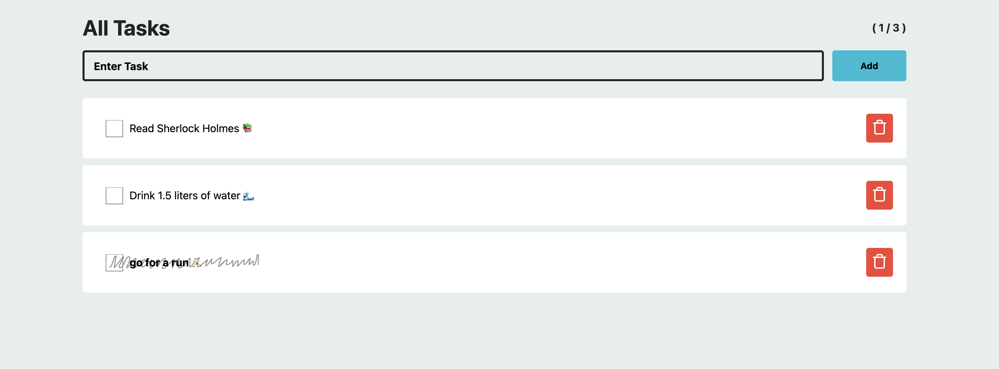

# TODO List | Task Manager ( Vodafone Case )

This project was developed using React. Its purpose is to make a simple TODO List application using React components, Typescript and Sass features.

The project was designed responsively and fake JSON-Server was used as the backend.

To run the project:

```yarn install ```

To run the fake backend server:

```yarn server```

Then to run the project:

```yarn start```

___

## Steps

1. [x] Fake backend (JSON-Server)
2. [x] React
3. [x] Typescript
4. [x] Sass
5. [x] Custom components
6. [x] Responsive design
7. [x] Lazy loading


___

## Secreen Shots


